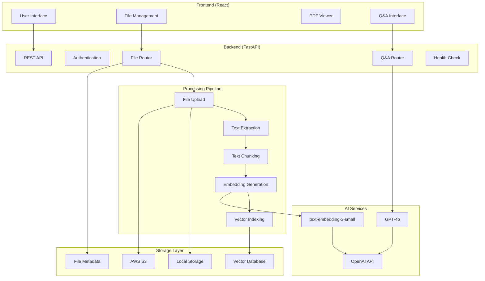

# RAG Document Processing Application

A full-stack **Retrieval-Augmented Generation (RAG)** application that enables users to upload documents, process them through an intelligent pipeline, and query them using natural language. The system combines document processing, vector embeddings, and large language models to provide accurate, context-aware responses.

## 🚀 Features

### Document Management
- **Multi-format Support**: PDF, DOCX, and TXT file processing
- **Intelligent Upload**: Drag & drop interface with file validation
- **Storage Flexibility**: Local and AWS S3 cloud storage support
- **File Operations**: Upload, view, download, and delete documents

### Document Processing Pipeline
- **Text Extraction**: Advanced text extraction using LangChain loaders
- **Smart Chunking**: Recursive text splitting with configurable parameters
- **Vector Embeddings**: OpenAI embeddings for semantic search
- **Vector Storage**: ChromaDB for efficient similarity search

### Question & Answer System
- **RAG Implementation**: Context-aware question answering
- **Streaming Responses**: Real-time response generation
- **Source Citation**: Traceable answers with document references
- **Configurable Retrieval**: Adjustable similarity thresholds and result counts

### User Interface
- **Modern React Frontend**: Responsive and intuitive design
- **PDF Viewer**: Interactive document viewing with navigation
- **Real-time Updates**: Live status updates and error handling
- **Health Monitoring**: Backend connectivity status

## 🏗️ Architecture



## 🛠️ Technology Stack

### Backend
- **Framework**: FastAPI (Python 3.11+)
- **Document Processing**: LangChain, PyPDF, python-docx, unstructured
- **Vector Database**: ChromaDB
- **Embeddings**: OpenAI text-embedding-3-small
- **LLM**: OpenAI GPT-4o
- **Storage**: Local filesystem + AWS S3
- **Async Processing**: Python asyncio
- **API Documentation**: OpenAPI/Swagger
- **Logging**: Custom stage-based logging system

### Frontend
- **Framework**: React 19.1.1
- **PDF Rendering**: react-pdf
- **HTTP Client**: Axios
- **Styling**: CSS3 with modern design patterns
- **Testing**: React Testing Library, Jest

### Infrastructure
- **Containerization**: Docker
- **Package Management**: UV (Python), npm (Node.js)
- **Cloud Storage**: AWS S3
- **Environment**: Environment-based configuration

## 📋 Project Structure

```
Devnco_Assignment/
├── backend/                    # FastAPI Backend
│   ├── src/
│   │   ├── main.py            # FastAPI application entry point
│   │   ├── routers/           # API route handlers
│   │   │   ├── files.py       # File management endpoints
│   │   │   ├── qa.py          # Question & Answer endpoints
│   │   │   ├── auth.py        # Authentication endpoints
│   │   │   ├── health.py      # Health check endpoints
│   │   │   └── database.py    # Database management
│   │   ├── services/          # Business logic layer
│   │   │   ├── ingestion.py   # Document processing pipeline
│   │   │   ├── retriever.py   # RAG retrieval and generation
│   │   │   └── storage.py     # File and vector storage
│   │   ├── schemas/           # Pydantic models
│   │   │   ├── file_upload.py
│   │   │   ├── question_and_answer.py
│   │   │   └── authentication.py
│   │   └── utils/
│   │       └── logger.py      # Custom logging system
│   ├── storage/
│   │   ├── uploads/           # Local file storage
│   │   └── chromadb/          # Vector database files
│   ├── config.py              # Application configuration
│   ├── database.py            # Database setup
│   ├── requirements.txt       # Python dependencies
│   ├── pyproject.toml         # Project metadata
│   ├── Dockerfile             # Container configuration
│   └── start_server.py        # Server startup script
│
├── frontend/                  # React Frontend
│   ├── src/
│   │   ├── components/
│   │   │   ├── FileList.js    # File management component
│   │   │   └── PDFViewer.js   # PDF viewing component
│   │   ├── services/
│   │   │   └── api.js         # Backend API client
│   │   ├── App.js             # Main application component
│   │   ├── App.css            # Application styles
│   │   └── index.js           # React entry point
│   ├── public/
│   │   ├── index.html         # HTML template
│   │   └── pdf.worker.min.js  # PDF.js worker
│   ├── package.json           # Node.js dependencies
│   └── README.md              # Frontend documentation
│
└── logs/                      # Application logs
```

## 🚀 Quick Start

### Prerequisites
- **Python**: 3.11 or higher
- **Node.js**: 14 or higher
- **OpenAI API Key**: Required for embeddings and LLM
- **AWS Credentials**: Optional (for S3 storage)

### Environment Setup

1. **Clone the repository**
   ```bash
   git clone <repository-url>
   cd Devnco_Assignment
   ```

2. **Set up environment variables**
   Create a `.env` file in the `backend/` directory:
   ```env
   # Required
   OPENAI_API_KEY=your_openai_api_key_here
   
   # Optional AWS S3 Configuration
   AWS_ACCESS_KEY_ID=your_aws_access_key
   AWS_SECRET_ACCESS_KEY=your_aws_secret_key
   
   # Server Configuration
   HOST=127.0.0.1
   PORT=8000
   DEBUG=true
   ```

### Backend Setup

1. **Navigate to backend directory**
   ```bash
   cd backend
   ```

2. **Install dependencies**
   ```bash
   # Using pip
   pip install -r requirements.txt
   
   # Or using uv (recommended)
   uv sync
   ```

3. **Start the backend server**
   ```bash
   python start_server.py
   ```

   The API will be available at:
   - **API Documentation**: http://127.0.0.1:8000/docs
   - **Health Check**: http://127.0.0.1:8000/api/v1/health/

### Frontend Setup

1. **Navigate to frontend directory**
   ```bash
   cd frontend
   ```

2. **Install dependencies**
   ```bash
   npm install
   ```

3. **Start the development server**
   ```bash
   npm start
   ```

   The application will open at: http://localhost:3000

## 🔄 Workflow

### Document Upload & Processing

1. **File Upload**
   - User uploads PDF, DOCX, or TXT files via drag & drop or file picker
   - Frontend validates file type and size (max 50MB)
   - File is sent to backend `/api/v1/files/upload` endpoint

2. **Processing Pipeline**
   ```
   Upload → Text Extraction → Chunking → Embedding → Vector Storage
   ```
   - **Text Extraction**: LangChain loaders extract text from documents
   - **Chunking**: Text is split into overlapping chunks (800 chars, 175 overlap)
   - **Embedding**: OpenAI generates vector embeddings for each chunk
   - **Storage**: Vectors stored in ChromaDB with metadata

3. **File Management**
   - Files stored locally or in AWS S3 (configurable)
   - Metadata tracked for efficient retrieval
   - Support for viewing, downloading, and deleting files

### Question & Answer Process

1. **Query Processing**
   - User submits question through Q&A interface
   - Query is embedded using same OpenAI model

2. **Retrieval**
   - Vector similarity search in ChromaDB
   - Retrieves top-k relevant document chunks
   - Configurable similarity thresholds

3. **Generation**
   - Relevant context combined with user query
   - GPT-4o generates contextual response
   - Sources cited in response

4. **Response Delivery**
   - Streaming response via Server-Sent Events
   - Real-time display in frontend interface

## 🔧 Configuration

### Backend Configuration (`config.py`)

```python
# File Processing
MAX_FILE_SIZE_MB = 50
ALLOWED_FILE_TYPES = [".pdf", ".docx", ".txt"]
CHUNK_SIZE = 800
CHUNK_OVERLAP = 175

# AI Models
OPENAI_EMBEDDING_MODEL = "text-embedding-3-small"
LLM_MODEL = "gpt-4o"
LLM_TEMPERATURE = 0.1

# Storage
USE_S3_STORAGE = True  # Toggle S3 vs local storage
S3_BUCKET_NAME = "my-rag-bucket-assignment"
CHROMA_DB_PATH = "storage/chromadb"

# RAG Settings
DEFAULT_RETRIEVAL_K = 5
MIN_SIMILARITY_THRESHOLD = 0.5
```

## 📊 API Endpoints

### File Management
- `POST /api/v1/files/upload` - Upload and process document
- `GET /api/v1/files/list` - List uploaded files
- `GET /api/v1/files/{file_id}/info` - Get file information
- `GET /api/v1/files/{file_id}/download` - Download file
- `GET /api/v1/files/{file_id}/view` - View file in browser
- `DELETE /api/v1/files/delete/{file_id}` - Delete file

### Question & Answer
- `POST /api/v1/qa/ask` - Ask question (streaming response)

### Health & Monitoring
- `GET /api/v1/health/` - Basic health check
- `GET /api/v1/health/detailed` - Detailed system status

### Database Management
- `POST /api/v1/database/reset` - Reset vector database

## 🐳 Docker Deployment

1. **Build and run backend**
   ```bash
   cd backend
   docker build -t rag-backend .
   docker run -p 8000:8000 --env-file .env rag-backend
   ```

2. **Frontend deployment**
   ```bash
   cd frontend
   npm run build
   # Deploy build/ folder to your preferred hosting service
   ```

## 🔍 Monitoring & Logging

The application includes comprehensive logging with stage-based tracking:

- **Processing Stages**: Upload → Extract → Chunk → Embed → Index
- **Timing Metrics**: Performance monitoring for each stage
- **Error Tracking**: Detailed error logging with context
- **Health Monitoring**: Real-time system status

Log files are stored in the `logs/` directory with timestamps.

## 🤝 Contributing

1. Fork the repository
2. Create a feature branch
3. Make your changes
4. Add tests if applicable
5. Submit a pull request

## 📝 License

This project is part of a development assignment and is for educational/evaluation purposes.

## 🆘 Troubleshooting

### Common Issues

1. **OpenAI API Key Error**
   - Ensure `OPENAI_API_KEY` is set in environment variables
   - Check API key validity and billing status

2. **File Upload Fails**
   - Verify file size is under 50MB
   - Check file format is supported (PDF, DOCX, TXT)
   - Ensure backend server is running

3. **PDF Viewer Not Working**
   - Verify `pdf.worker.min.js` is in `public/` directory
   - Check browser console for JavaScript errors

4. **Backend Connection Error**
   - Ensure backend is running on correct port (8000)
   - Check CORS configuration for frontend domain

### Performance Optimization

- **Chunk Size**: Adjust `CHUNK_SIZE` and `CHUNK_OVERLAP` for your documents
- **Retrieval**: Tune `DEFAULT_RETRIEVAL_K` and similarity thresholds
- **Storage**: Use S3 for production deployments
- **Caching**: Consider implementing response caching for frequent queries

---

**Built with ❤️ using FastAPI, React, LangChain, and OpenAI**